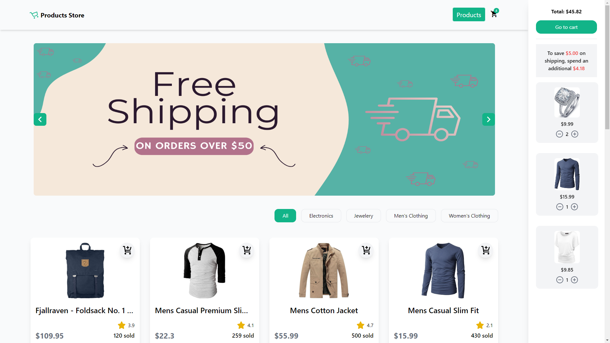
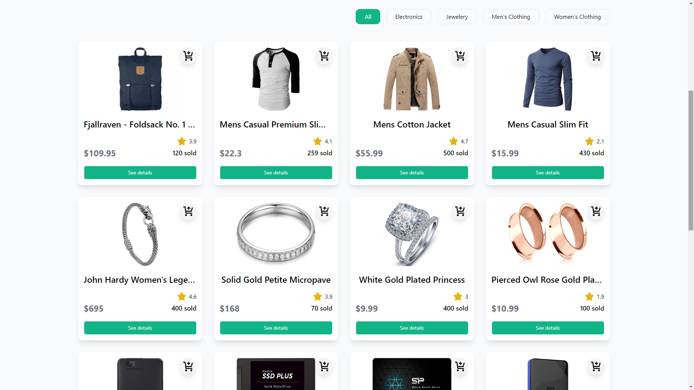
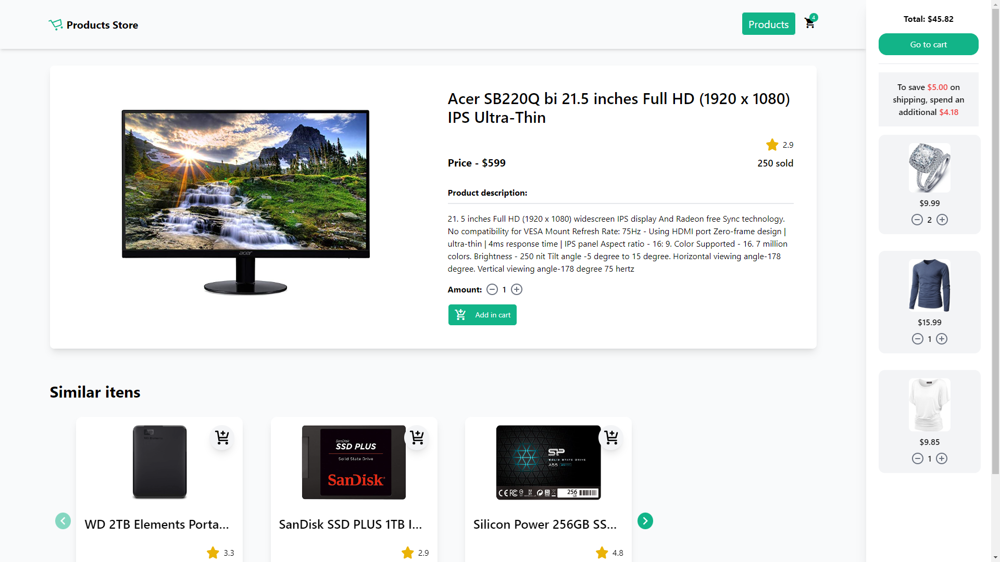
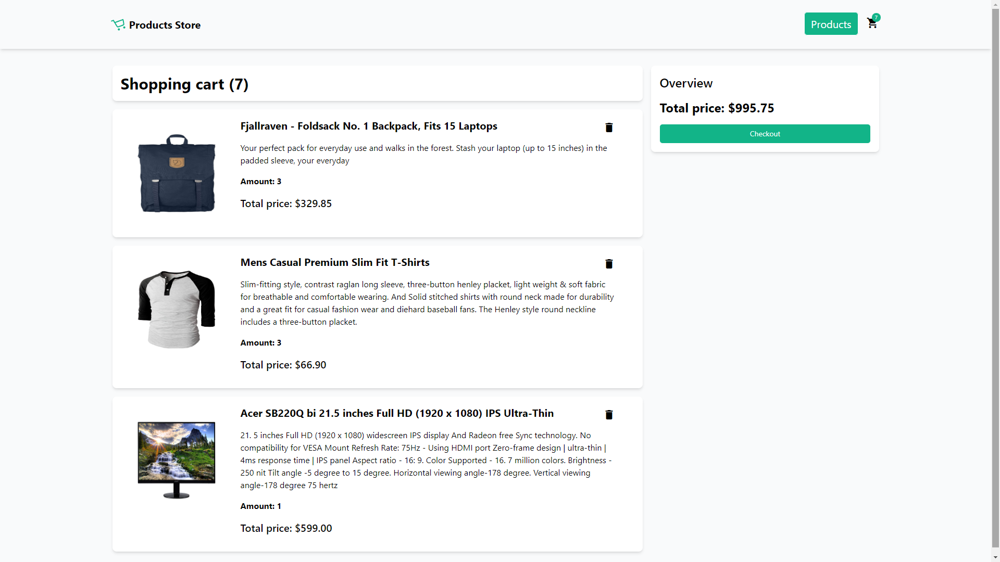

<div align="center"> <h1>Products Store</h1> </div>

<p align="center">Aplicação de vendas com carrinho persistente, desenvolvida com Nuxt.js!</p>
 
<p align="center">
  
  
  
  
  
</p>

## 📝 Sobre o projeto

Esta aplicação de vendas foi construída utilizando o framework Nuxt.js, com integração a uma API fictícia para listar e exibir os produtos disponíveis. O Pinia foi implementado para gerenciar o estado do carrinho de compras, garantindo que os itens permaneçam salvos no navegador, mesmo após atualizar ou fechar a página, trazendo uma experiência semelhante ao AliExpress.

## 🛠 Tecnologias utilizadas

-   **Vue.js** - Framework JavaScript progressivo
-   **Nuxt.js** - Framework baseado em Vue.js para SSR
-   **Pinia** - Biblioteca de gerenciamento de estado
-   **JavaScript** - Linguagem de programação
-   **HTML** - Estrutura do conteúdo
-   **CSS** - Estilização da interface
-   **Tailwind CSS** - Framework de estilos

## 📸 Screenshots

<p align="center">
  
</p>

<p align="center">
  
</p>

<p align="center">
  
</p>

<p align="center">
  
</p>

## 🌐 Acesse o projeto online
Você pode acessar a versão online do projeto [aqui](https://mauricio-products-store.netlify.app).

## 🖥️ Como configurar o projeto

Siga os passos abaixo para instalar e executar o projeto em seu ambiente local:

### 1. Clone o repositório:

```bash
$ git clone https://github.com/mauricio071/Products-Store
```

### 2. Acesse o diretório do projeto:

```bash
$ cd Products-Store
```

### 3. Instale as dependências necessárias:

```bash
$ npm install
```
ou

```bash
$ yarn install
```

### 4. Inicialize o projeto:

```bash 
$ npm run dev
```
ou, se estiver usando yarn:

```bash 
$ yarn dev
```
Agora você pode acessar o projeto no navegador em http://localhost:3000 (ou na porta indicada pelo terminal).
